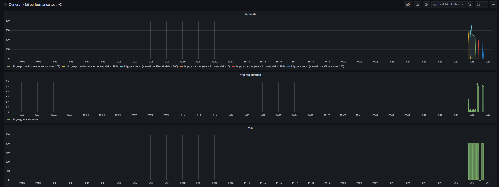

# Similar Products API

## Tech Stack

*   **Java 21**
*   **Spring Boot 3.5.7**
*   **RestClient** for HTTP calls
*   **springdoc-openapi** for API documentation (Swagger UI)
*   **Hexagonal / Ports & Adapters architecture**
*   **Virtual Threads** (`Executors.newVirtualThreadPerTaskExecutor`) to parallelize external calls
*   **k6 + Docker + InfluxDB + Grafana** for performance tests and dashboards
*   **JUnit 5 + Mockito + MockWebServer** for unit and integration tests

## Architecture Overview

### High-level layers:

*   **Domain**
    *   `ProductDetail` (record)
    *   Exceptions: `ProductNotFoundException`, `ExternalServiceException`
    *   Ports:
        *   `GetSimilarProductsQuery` (inbound)
        *   `ProductRepository` (outbound)
*   **Application**
    *   `GetSimilarProductsService`
        *   Implements `GetSimilarProductsQuery`
        *   Calls `ProductRepository`
        *   Uses an `ExecutorService` with virtual threads to parallelize calls to the external API.
*   **Infrastructure**
    *   `ProductRestClientAdapter` (REST client)
        *   Implements `ProductRepository` using `RestClient`
        *   Translates HTTP status codes to domain exceptions
    *   `ProductController`
        *   Exposes `/product/{productId}/similar`
        *   Annotated with springdoc OpenAPI annotations
    *   `GlobalExceptionHandler`
        *   Maps domain exceptions to HTTP responses:
            *   `ProductNotFoundException` → 404 Product Not found
            *   `ExternalServiceException` → 502 Upstream service error
            *   Any other exception → 500 An unexpected error occurred
    *   `AppConfig`
        *   Configures `RestClient` with base URL and timeouts
        *   Configures the virtual thread executor

## Running the Application

### Prerequisites

*   JDK 21
*   Maven 3.x
*   Docker + Docker Compose

### 1. Start mocks and infrastructure

From the root folder (where `docker-compose.yml` is):

```bash
docker-compose up -d simulado influxdb grafana
```

Check the mock is running:

```bash
curl http://localhost:3001/product/1/similarids
# [2,3,4]
```

### 2. Start the Spring Boot application

```bash
mvn spring-boot:run
```

By default it starts on port 5000:

```bash
curl http://localhost:5000/product/1/similar
```

### 3. OpenAPI / Swagger UI

Once the app is running you can explore the API documentation at:

*   **OpenAPI JSON**: [http://localhost:5000/v3/api-docs](http://localhost:5000/v3/api-docs)
*   **Swagger UI**: [http://localhost:5000/swagger-ui.html](http://localhost:5000/swagger-ui.html)

## Performance Testing with k6

The repository includes a k6 script that exercises the endpoint under different scenarios:

```javascript
scenarios: {
  normal:   { executor: 'constant-vus', vus: 200, duration: '10s' },
  notFound: { executor: 'constant-vus', vus: 200, duration: '10s', startTime: '10s' },
  error:    { executor: 'constant-vus', vus: 200, duration: '10s', startTime: '20s' },
  slow:     { executor: 'constant-vus', vus: 200, duration: '10s', startTime: '30s' },
  verySlow: { executor: 'constant-vus', vus: 200, duration: '10s', startTime: '50s' },
}
```

Each scenario hits:

*   `normal` → `/product/1/similar`
*   `slow` → `/product/2/similar`
*   `verySlow` → `/product/3/similar`
*   `notFound` → `/product/4/similar`
*   `error` → `/product/5/similar`

### Running k6 tests

With the mocks and app running:

```bash
docker-compose run --rm k6 run scripts/test.js
```

k6 pushes metrics to InfluxDB, and Grafana reads from there to display the dashboards.

### Performance Results

#### k6 CLI Output


**Summary**

*   5 scenarios, 200 constant VUs per scenario, 10 seconds each.
*   ~7,700 complete iterations and 600 interrupted.
*   Average `http_req_duration` ≈ ~812 ms, with p(90) and p(95) around 5–6 s, reflecting the `slow` and `verySlow` endpoints.
*   `connection reset by peer` warnings correspond to requests to `/product/2/similar` closed by the server when the scenario is interrupted (expected behavior for the load test).

**Key highlights:**

*   The endpoint supports 200 simultaneous VUs per scenario without major failures.
*   Response time is dominated by the artificial latency of the mock API (delays in products 100/1000/10000).
*   Virtual threads logic allows overlapping calls to similar products, so response time approaches the maximum of latencies, not the sum.

#### Grafana Dashboard



**What you see in the dashboard**

*   **Requests** (top chart): peaks of ~200 requests per second for each scenario (`normal`, `notFound`, `error`, `slow`, `verySlow`) in the corresponding intervals.
*   **http_req_duration** (center chart): the average request duration grows when the `slow` and especially `verySlow` scenarios come into play, reaching several seconds due to the delays configured in the mock.
*   **VUs** (bottom chart): clearly shows the 200 active virtual users during each 10-second window of each scenario.

**This demonstrates that:**

*   The API behaves stably under sustained load.
*   Response times follow the expected pattern based on the delays configured in the mock.
*   The k6 + InfluxDB + Grafana integration is correctly configured to observe the solution's behavior.

## Testing

### Unit tests

*   **Service**: `GetSimilarProductsServiceTest`
    *   Test cases: null/empty lists, filtering of `Optional.empty`, exception handling per ID, and preservation of `similarIds` order.
*   **Adapter**: `ProductRestClientAdapterTest`
    *   Mocks `RestClient` and verifies:
        *   200 OK → correct data.
        *   404 → `ProductNotFoundException` or `Optional.empty()`.
        *   Client errors (`RestClientException`) → `ExternalServiceException`.
*   **Controller**: `ProductControllerTest`
    *   200 with data, 200 with empty list.
    *   404, 502, and 500 mapped by `GlobalExceptionHandler`.

### Integration test

*   **SimilarProductsApiIntegrationTest**
    *   Uses `MockWebServer` to simulate the external API.
    *   Overrides `external-api.url` with `@DynamicPropertySource`.
    *   Verifies end-to-end flow:
        *   `/product/{id}/similarids` + `/product/{id}` → `/product/{id}/similar` with correct JSON.
        *   404 in upstream → `Product Not found` in public API.

## How to Run Tests

```bash
mvn test
```

This executes:

*   Unit tests (service, adapter, controller).
*   Integration test with MockWebServer.
